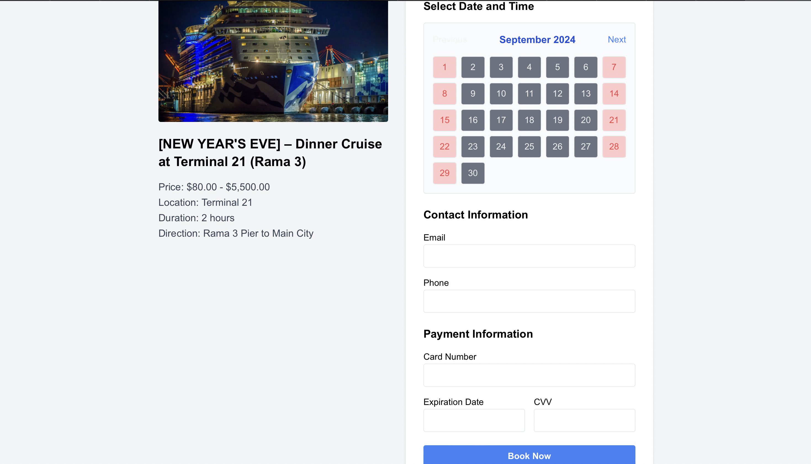

# Sailing

A collaborative project for booking and managing sailing trips. This application allows users to select from various sailing options, check availability, and make secure bookings.

## Contributors

- **Arkar Phyo**  
  Student ID: 6520052

- **Min Thet Naung**  
  Student ID: 6530142

## Features

- Browse and select from multiple sailing destinations.
- Check availability based on date and time.
- Secure booking process with real-time validation.
- View existing bookings.

## Pages

### Home Page

The **Home Page** introduces the user to the available sailing trips. It contains options to explore trips, view pricing, and start a booking.


### Booking Page

The **Booking Page** allows users to choose their preferred sailing trip, select available dates, and proceed with the booking process.


### Booking Form Page

On the **Booking Form Page**, users provide personal details such as email, phone number, and payment information to finalize their booking.



## Installation

Follow these steps to get the project running on your local machine:

```bash
# Clone the repository
git clone https://github.com/your-username/sailing.git

# Navigate to the project directory
cd sailing

# Install dependencies
npm install

# Start the development server
npm run dev
